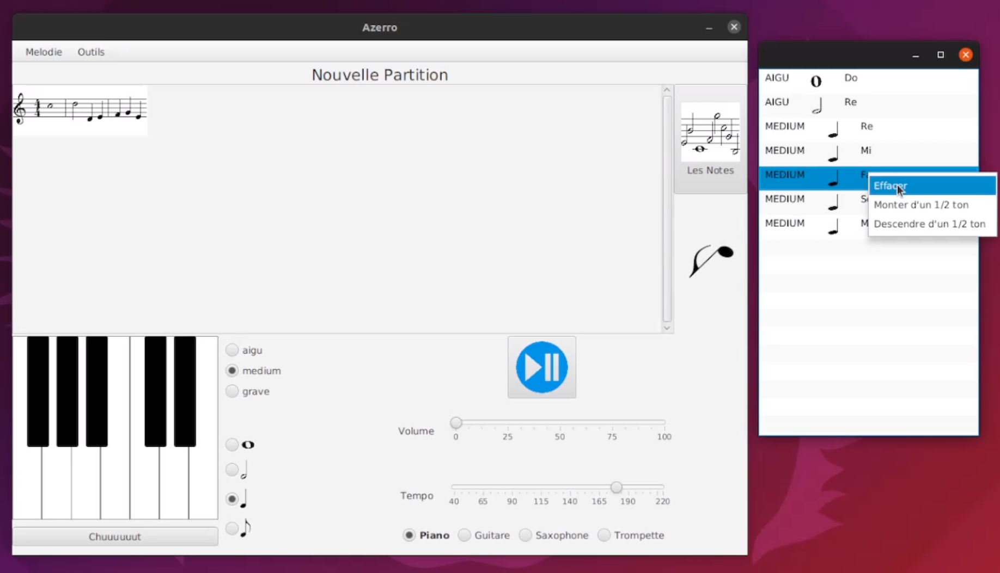
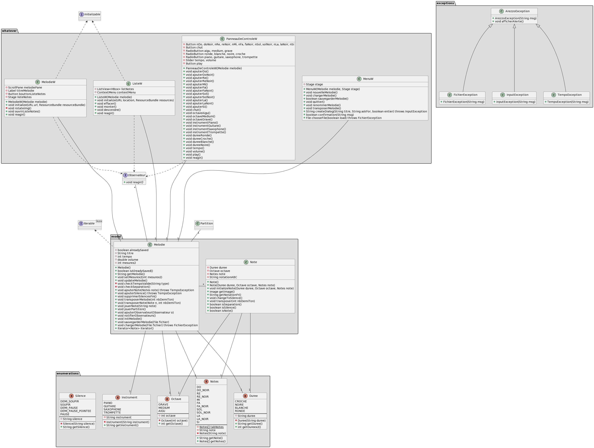

# Twisk

Cette application a été réalisé durant le quatrième semestre de ma formation à l'université Faculté des Sciences et Technologies de Vandoeuvre-lès-Nancy (54500 France)

## Description 

Logiciel de composition et de lecture de partitions élémentaires de musique.

## Aperçu 

## Dépendances

- OS : Ubuntu 20.04

## Diagrammes des classes

## Auteur
[LESNIAK Louis](https://github.com/LESNIAK-Louis)